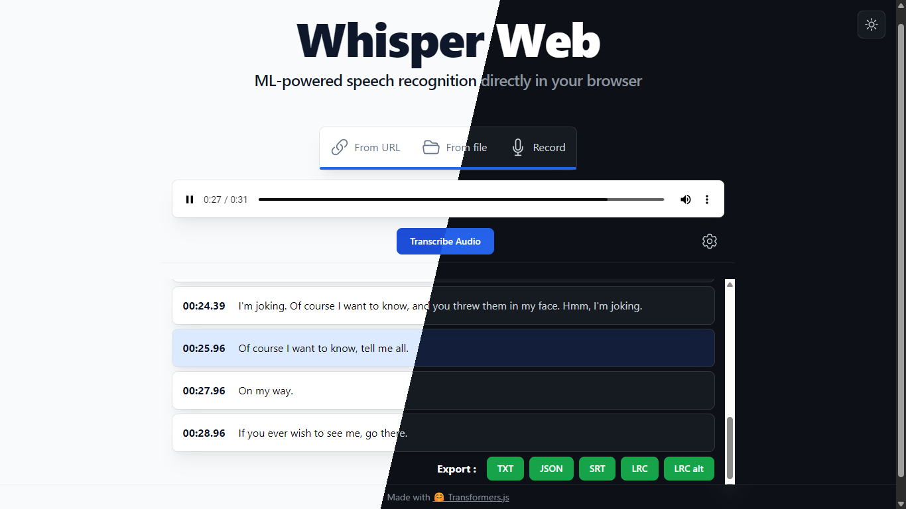

# Whisper Web (light/dark mode fork)

This is a fork of the original Whisper Web with light/dark mode support.



**Key Differences from Original**
- **Dark Mode**: Full support for light and dark themes.
- **Interactive Transcript**:
  - Click on any line to jump to that part of the audio.
  - Highlights the currently spoken line in real-time.
  - Auto-scrolls to keep the active line in view.
- **Expanded Export Options**: Support for SRT (subtitles) and LRC (lyrics) formats, in addition to standard TXT and JSON.

## Whisper Web

ML-powered speech recognition directly in your browser! Built with [🤗 Transformers.js](https://github.com/xenova/transformers.js).

Check out the demo site (original repo) [here](https://huggingface.co/spaces/Xenova/whisper-web). 

> [!IMPORTANT]  
> Experimental WebGPU support has been added to [this branch](https://github.com/xenova/whisper-web/tree/experimental-webgpu) ([demo](https://huggingface.co/spaces/Xenova/whisper-webgpu)), if you'd like to run with GPU acceleration!

https://github.com/xenova/whisper-web/assets/26504141/fb170d84-9678-41b5-9248-a112ecc74c27

## Running locally

1. Clone the repo and install dependencies:

    ```bash
    git clone https://github.com/xenova/whisper-web.git
    cd whisper-web
    npm install
    ```

2. Run the development server:

    ```bash
    npm run dev
    ```
    > Firefox users need to change the `dom.workers.modules.enabled` setting in `about:config` to `true` to enable Web Workers.
    > Check out [this issue](https://github.com/xenova/whisper-web/issues/8) for more details.

3. Open the link (e.g., [http://localhost:5173/](http://localhost:5173/)) in your browser.
