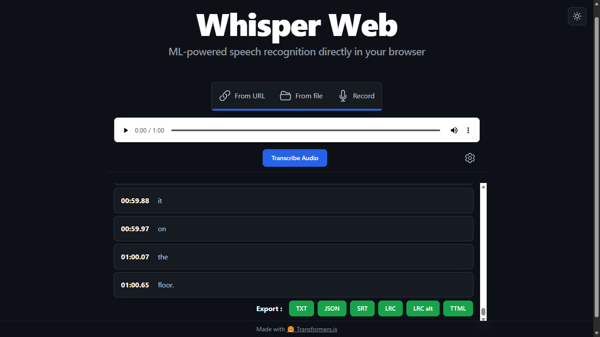
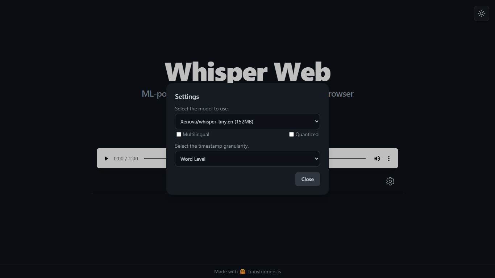

# Whisper Web (light/dark mode fork)

This is a fork of the original Whisper Web with light/dark mode support. Export to JSON, TXT, SRT, LRC, Enhanced LRC, TTML format.




**Key Differences from Original**
- **Dark Mode**: Full support for light and dark themes.
- **Interactive Transcript**:
  - Click on any line to jump to that part of the audio.
  - Highlights the currently spoken line in real-time.
  - Auto-scrolls to keep the active line in view.
- **Expanded Export Options**: 
  - **TTML Support**: Advanced export with word-by-word millisecond precision in a standardized XML format (`<p>` for lines, `<span>` for words).
  - **Enhanced LRC (eLRC)**: Word-level timestamps in LRC format (e.g., `[mm:ss.xx]<mm:ss.xx>Word`).
  - **SRT & LRC**: Support for standard subtitle and lyric formats.
  - **JSON & TXT**: Standard data exports.
- **Timestamp Granularity**: 
  - **Word-Level**: Choose to generate timestamps for every single word.
  - **Segment-Level**: Traditional per-line groupings.

## Downloading Models (Offline Support)
Use the included scripts to easily download ONNX models and their configurations for offline use. This script lets you select which model (e.g., tiny, base, small, medium) and whether to use quantized versions.

**Windows:**
1. Navigate to the `public` folder.
2. Double-click `download_models.cmd` OR run via PowerShell:
   ```powershell
   cd public
   .\download_models.ps1
   ```

**Linux / macOS:**
1. Navigate to the `public` folder.
2. Run the bash script:
   ```bash
   cd public
   bash download_models.sh
   ```

Follow the on-screen prompts to select your model. The files will be correctly placed in `public/models/`, and the web app will automatically prioritize these local models.

## Whisper Web

ML-powered speech recognition directly in your browser! Built with [🤗 Transformers.js](https://github.com/xenova/transformers.js).

Check out the demo site (original repo) [here](https://huggingface.co/spaces/Xenova/whisper-web). 

> [!IMPORTANT]  
> Experimental WebGPU support has been added to [this branch](https://github.com/xenova/whisper-web/tree/experimental-webgpu) ([demo](https://huggingface.co/spaces/Xenova/whisper-webgpu)), if you'd like to run with GPU acceleration!

https://github.com/xenova/whisper-web/assets/26504141/fb170d84-9678-41b5-9248-a112ecc74c27

## Running locally

1. Clone the repo and install dependencies:

    ```bash
    git clone https://github.com/xenova/whisper-web.git
    cd whisper-web
    npm install
    ```

2. Run the development server:

    ```bash
    npm run dev
    ```
    > Firefox users need to change the `dom.workers.modules.enabled` setting in `about:config` to `true` to enable Web Workers.
    > Check out [this issue](https://github.com/xenova/whisper-web/issues/8) for more details.

3. Open the link (e.g., [http://localhost:5173/](http://localhost:5173/)) in your browser.

## Using Local Models

This application is configured to load ONNX models locally if they are present, preventing the need to re-download them when switching.

1.  **Download the Model**: Download the ONNX model files (including `config.json`, `tokenizer.json`, `model.onnx`, etc.) from Hugging Face.
2.  **Create Directory**: Create a folder structure in `public/models/` that matches the model name.
    *   For example, if you want to use `Xenova/whisper-tiny.en`, create the folder:
        `public/models/Xenova/whisper-tiny.en`
3.  **Place Files**: Place the downloaded model files inside that folder.

The app will check this local directory first. If the model is found, it will load it directly. If not, it will attempt to download it from the Hugging Face Hub (checks for existence online if not found local).
